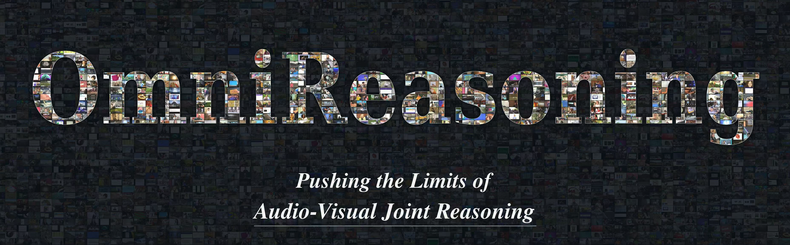
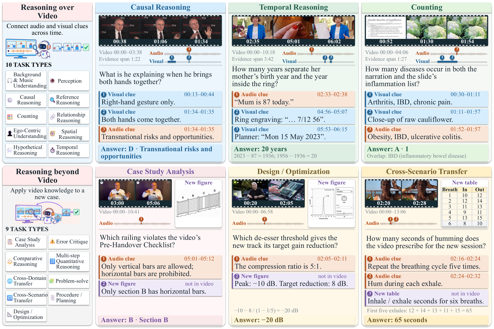
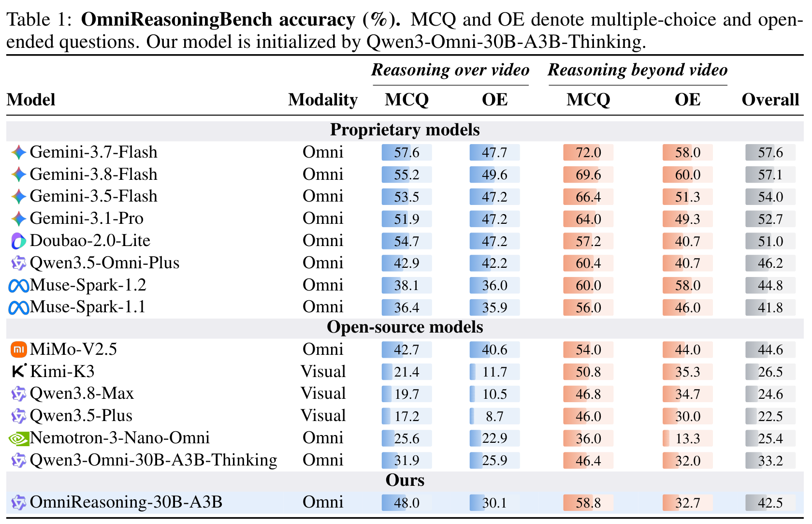
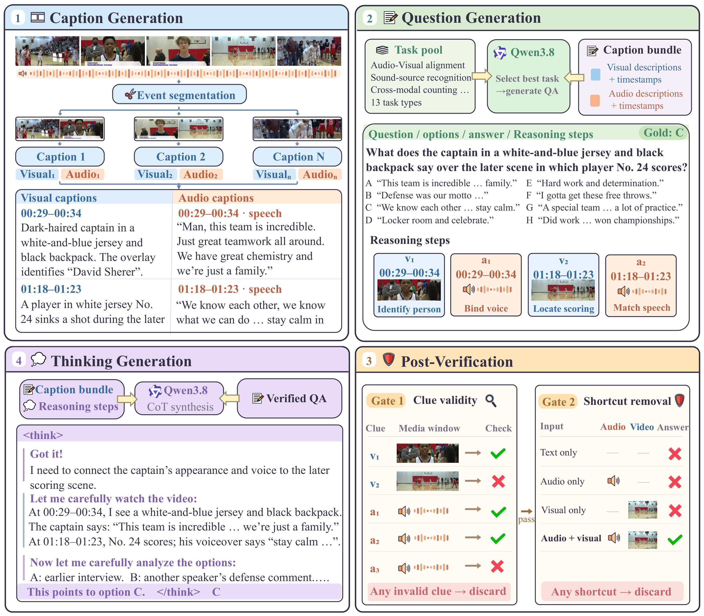

<div align="center">

# OmniReasoning: Pushing the Limits of Audio-Visual Joint Reasoning

<p>
  <a href="https://pku-value-lab.github.io/OmniReasoning-Homepage/">
    
  </a>
  <a href="https://arxiv.org/pdf/2609.39490">
    
  </a>
  <a href="#-benchmark">
    
  </a>
  <a href="#-code--models">
    
  </a>
  <a href="#-license">
    
  </a>
</p>

</div>


**OmniQA** constructs audio-visual joint reasoning data. **OmniReasoningBench** evaluates
*reasoning over video* and *reasoning beyond video*.
The released datasets are **OmniReasoning-SFT-112K** (112,463 samples with synthesized thinking)
and **OmniReasoning-RL-19K** (18,991 questions with evidence annotations), retained from the
original 116,217 SFT and 19,849 RL samples; the benchmark has **1,150 questions**.


[](assets/readme/123.png)

### OmniReasoningBench

OmniReasoningBench contains 750 *reasoning over video* questions (375 multiple-choice, 375
open-ended) and 400 *reasoning beyond video* questions (250 multiple-choice, 150 open-ended;
288 video + figure and 112 video + text inputs). Each has a reference answer and an annotated
evidence chain.

[](./assets/readme/benchmark.png)

### Results on OmniReasoningBench

[](./assets/readme/benchmark_results.png)

All figures are from the paper. Click an image to open the original resolution.

## Installation

Run all commands from the repository root. Requires **Python 3.10+** and **ffmpeg / ffprobe**.

```bash
python -m pip install '.[engine]'
```

| Stage               | Service                                                      | Configuration                                                |
| ------------------- | ------------------------------------------------------------ | ------------------------------------------------------------ |
| 1 caption           | Gemini `generateContent`                                     | `GEMINI_API_KEY`, `GEMINI_API_BASE`, `GEMINI_AUTH_PREFIX`; `--gemini-model` |
| 2 generate / adapt  | OpenAI-compatible chat (+ `/images/generations` for RBY figures) | `OPENAI_API_KEY`, `OPENAI_API_BASE`; `--openai-model`, `GEN_MODEL`, `IMAGE_MODEL` |
| 3 verify / refine   | OpenAI-compatible chat                           | `DASHSCOPE_API_KEY`, optional `DASHSCOPE_BASE_URL`           |
| 3 gate              | text model + audiovisual model                               | `GATE_TEXT_*`, `GATE_AV_*`, `OPENAI_API_KEY`                 |
| 4 think             | OpenAI-compatible chat                                       | `OPENAI_API_KEY`, `OPENAI_API_BASE`, `SYNTH_MODEL`           |
| Benchmark inference | SGLang / OpenAI-compatible audiovisual server                | `SGLANG_BASE_URL`, `SGLANG_API_KEY`, `SGLANG_MODEL`          |
| Benchmark judge     | OpenAI-compatible chat                                       | `JUDGE_API_BASE`, `JUDGE_API_KEY`, `JUDGE_MODEL`             |

Place source videos in `data/videos/`.

## OmniQA Data Engine

[](./assets/readme/data_engine.png)

### Stage 1: Caption Generation

```bash
omniqa caption --data-path data/videos --output-dir data/caption/videos \
  --gemini-model gemini-3.1-pro-preview \
  --skip-upload --max-inline-video-mb 20 --max-events 64
```


### Stage 2: QA Generation

Each route writes `outputs/run/generation/accepted.jsonl` with question, options, answer and a
`reasoning_steps` dependency chain.

**Reasoning over video (ROV):** task selection, question/answer/chain generation, structural and
grounding checks, a caption-conditioned solver, and a question-only (priors) blind gate.

```bash
omniqa generate --caption-raw-dir data/caption/videos/raw \
  --output-dir outputs/run/generation \
  --openai-api-base "$OPENAI_API_BASE" --openai-model deepseek-v4-flash \
  --questions-per-video 1
```

**Reasoning beyond video (RBY),** including generated question figures:

```bash
omniqa adapt --caption-dir data/caption/videos/raw --outdir outputs/run/generation --n 0
omniqa bridge-adaptation --outdir outputs/run/generation \
  --output outputs/run/generation/accepted.jsonl
```

**Direct video authoring (DYNAMIC):** the author watches the video; subtype weights must first be
mined from benchmark result files with `omniqa mine-queries` (see `--help`).

```bash
omniqa dynamic --caption-raw-dir data/caption/videos/raw --output-dir outputs/run/generation
```

### Stage 3: Verification

```bash
# 1. Verify timestamped clues against the actual clips (DashScope SDK).
omniqa verify --input outputs/run/generation/accepted.jsonl \
  --output-dir outputs/run/verification
# 2. Repair or reject questions against the video (DashScope SDK).
omniqa refine --input outputs/run/verification/accepted_verified.jsonl \
  --output-dir outputs/run/refinement
# 3. Modality shortcut screening.
omniqa gate --input outputs/run/refinement/refined_accepted.jsonl \
  --caption-raw-dir data/caption/videos/raw --video-root data/videos \
  --output-dir outputs/run/gate
```


### Stage 4: Thinking Generation

```bash
omniqa think --input outputs/run/refinement/refined_accepted.jsonl \
  --caption-root data/caption --output-dir outputs/run/thinking
```


## Evaluation

### 1. Prepare the benchmark and model service

Place the two benchmark files at `data/benchmark/over_video.jsonl` (750) and
`data/benchmark/beyond_video.jsonl` (400), with videos and figures under `data/media/`.
Start an audiovisual SGLang / OpenAI-compatible server and export `SGLANG_*`.

### 2. Run inference

```bash
for s in over_video beyond_video; do
  omnireasoning infer --benchmark $s \
    --data_json_file data/benchmark/$s.jsonl --video_dir data/media \
    --output_file outputs/$s.jsonl --model "$SGLANG_MODEL"
done
```

Defaults: 2 fps, at most 512 frames, audio kept, `--max_tokens 32768 --temperature 0.6 --top_p 0.95 --top_k 20`.

### 3. Score

Multiple-choice answers are scored by rule-based option-letter matching (no LLM fallback; an
output without a parseable letter is wrong). Open-ended answers are judged by deepseek-v4-flash.
Every benchmark question stays in the denominator: missing outputs, service errors and judge
failures count as wrong.

```bash
for s in over_video beyond_video; do
  omnireasoning score-judge --predictions outputs/$s.jsonl \
    --references data/benchmark/$s.jsonl --out_dir outputs/${s}_judge
done

# Table row: over-video MCQ / OE, beyond-video MCQ / OE, Overall (pooled counts).
omnireasoning report-table \
  --over_video_pred outputs/over_video_judge/predictions.jsonl --over_video_ref data/benchmark/over_video.jsonl \
  --beyond_video_pred outputs/beyond_video_judge/predictions.jsonl --beyond_video_ref data/benchmark/beyond_video.jsonl
```


## 📚 Citation

If you find **OmniReasoning** useful, please cite:

```bibtex
@misc{lin2026omnireasoningpushinglimitsaudiovisual,
      title={OmniReasoning: Pushing the Limits of Audio-Visual Joint Reasoning}, 
      author={Junming Lin and Yuxuan Wang and Zhenxin Lei and Yuxin Liu and Ruixun Liu and Yinsong Yan and Ling Wang and Minghao Han and Yunfei Chu and Shun Lei and Xueyao Zhang and Qize Yang and Jin Xu and Yiwu Zhong},
      year={2026},
      eprint={2609.39490},
      archivePrefix={arXiv},
      primaryClass={cs.CV},
      url={https://arxiv.org/abs/2609.39490}, 
}
```

---


## 📄 License

The **OmniReasoning** data is released for **non-commercial research use** under **CC BY-NC 4.0**. Code and model licenses will accompany their respective releases.
